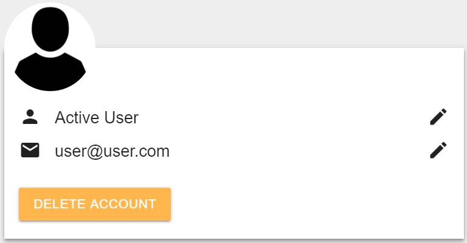

# Pothole Patchers

## About the App

The Pothole Patcher app is a ticket management and dispatch system that can be used by any company that does some service / utility work to customers.
The theme of this app is something that affects everyone, Potholes..
Users can easily report potholes to be scheduled and dispatched on and get it fixed. Even better, the can get rewarded for every successful ticket they create.

## Technologies

This app uses many technologies and APIs:

```
ExpressJS for creating back-end server.
MongoDB database for data storage and users and employees login.
PassportJS for Registration and login authentication.
bcrypt for password encryption and hashing.
other dependencies to make file storage to mongodb possible.
ReactJS for front-end user interface.
MaterializeCSS for layouts and components.
```
APIs used:
```
Google Maps API to show map box in the ticket.
Open Weather API to show forecast weather.
Browser Geolocation API to determine user's location.
```

## User Story
First off, the app uses same login and register components to authenticate users and employees. but they link differently depending on their parant components.


After user login, they prompted to main page

The main page poens up the general logo and 2 main components, the City announcements that can be used by the city to pass up some information or advertisement. Also, there is weather forecast for the next few day. it gets updated every three hours.
The main page has some "turned off" components, that can be turned on without refreshing the page (thanks to React).
those components can be listed as: 

### Create Ticket Component:
This is very simple form component with bunch of input elements that is utilised to create new ticket. it has a button to fill out the address automatically.. it uses browser's geolocation API and google geolocation API together. Also, it has a regular submit button.

Right after creating the ticket, A Toast component shows up to indicate a successful ticket creation.

### Stats Component:
Stats component shows the user's number of ticket and break them down to 3 categories.. Aproved, Rejected, and Pending


### User Profile:
This is a simple form where user can change their full name, email address, and photo avatar. they also can delete their account entirely from the system.


### Gift Card Component: 
This is where the user get rewarded and redeem points into gift card code. Users can get to this reward component when they reach 1000 points. Users get rewarded with 50 points for every approved tickets.


### A notification bell icon:
Whenever any ticket for the user gets approved, the user gets a notification of that. right now, the system register one notification and gets overwriten by other incoming notifications.

### Finally, The side Nav:
Side nav is MaterialCSS component that controls everything in the main page. 
It has toggles to other components and also it shows user's points and enables user to get to the gift card redeem component.


## Inspector Story:
Inspector story is simpler than User story.. The inspector takes the tickets where they left off and dispatch on one ticket at a time by tapping on the dispatch button. 


### Workflow Component:
They head out to the job location and do there job using the workflow guideline component that leads the inspector to the correct steps to perform a successful dispatch.


### Inspector Month Stat Component: 
User can check the total count of tickets created for the current month, also the ammount of ticket been inspected.


## City Worker Story:
Finally, this is Worker's view.. Which is the simplest among the others.
the user has 2 components

### Completed Tickets:
This component show all completed ticket for the current day, along with the total time it took the team to complete that job.
it has simple dispatch button that will dispatch the worker on a random approved job.
the logic behide that is to provide a fair chance for every dispatch team to get a random diffeculity job in the pool.


### Workflow Component: 
This component provides the worker with a means to perform a successful dispatch, with some checklist to minimize mistakes.
it also provides a form so submit an image of the final product.


finally if you would like to visit this project, please click here [Pothole Patchers](https://pothole-patchers.herokuapp.com)